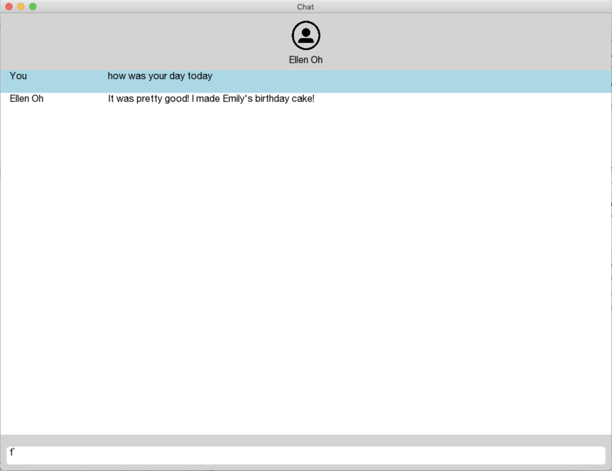

# Final Project: Customized chatbot!

To use this chatbot, go to ofApp.cpp and replace filepath with an absolute filepath to a conversation json in the same format that Facebook uses. You will also need to supply the name of the user that the chatbot will mimic. Then, run the project with Xcode, and there you have it!

